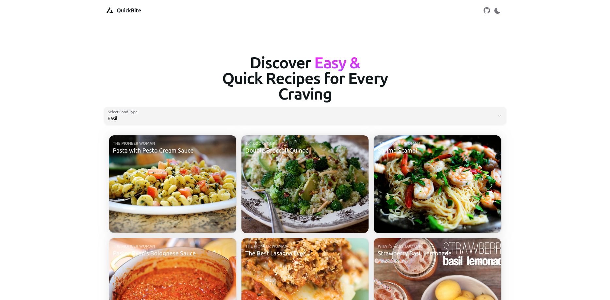

# QuickBite: Recipe Finder App



QuickBite is a modern, user-friendly recipe finder application that helps users discover easy and quick recipes based on their food preferences. Built with React, TypeScript, and HeroUI, this application fetches recipe data from the Forkify API and presents it in a beautiful, responsive interface.

## 📋 Features

- **Food Type Selection**: Choose from a wide variety of food ingredients using a dropdown menu
- **Recipe Gallery**: View a responsive grid of recipe cards with images and descriptions
- **Dynamic Search**: Instantly search and find recipes based on selected ingredients
- **Responsive Design**: Fully responsive layout that works on mobile, tablet, and desktop devices
- **Dark/Light Theme**: Toggle between dark and light themes for comfortable viewing

## 🛠️ Technologies Used

- **Framework**: React 18
- **Language**: TypeScript
- **Bundler**: Vite
- **UI Library**: HeroUI Components
- **Styling**: Tailwind CSS
- **Routing**: React Router DOM
- **Animations**: Framer Motion
- **API**: Forkify API for recipe data

## 🔧 Installation & Setup

1. **Clone the repository**

   ```bash
   git clone https://github.com/AhmedEsam2002/quickbite.git
   cd quickbite
   ```

2. **Install dependencies**

   ```bash
   npm install
   # or
   yarn install
   # or
   pnpm install
   ```

3. **Run the development server**

   ```bash
   npm run dev
   # or
   yarn dev
   # or
   pnpm dev
   ```

4. **Open your browser**
   Navigate to [http://localhost:5173](http://localhost:5173) to see the application running.

## 🏗️ Project Structure

```
quickbite/
├── public/            # Static assets
├── src/
│   ├── APIs/          # API calls and data fetching
│   ├── components/    # Reusable UI components
│   ├── config/        # Site configuration
│   ├── layouts/       # Page layouts
│   ├── pages/         # Application pages
│   ├── styles/        # Global styles
│   ├── types/         # TypeScript type definitions
│   ├── App.tsx        # Main App component
│   └── main.tsx       # Application entry point
├── .eslintrc.json     # ESLint configuration
├── package.json       # Project dependencies and scripts
├── tailwind.config.js # Tailwind CSS configuration
├── tsconfig.json      # TypeScript configuration
└── vite.config.ts     # Vite configuration
```

## 🔍 Usage

1. Select a food type from the dropdown menu
2. Browse through the gallery of recipes
3. Click on a recipe card to view details

## 📱 API Reference

This project uses the [Forkify API](https://forkify-api.herokuapp.com/) for fetching recipe data.

**Example Query:**

```
https://forkify-api.herokuapp.com/api/search?q=pizza
```

## 🛠️ Build for Production

```bash
npm run build
```

This will generate optimized production files in the `dist` directory.

## 🔄 Future Enhancements

- Add recipe details page
- Implement user authentication
- Add favorites functionality
- Implement search history
- Create shopping list feature

## 👨‍💻 Author

- **Ahmed Esam** - [GitHub Profile](https://github.com/AhmedEsam2002)

## 📝 License

This project is licensed under the MIT License - see the [LICENSE](LICENSE) file for details.

## 🙏 Acknowledgements

- [HeroUI](https://heroui.com) for the beautiful UI components
- [Forkify API](https://forkify-api.herokuapp.com/) for providing recipe data
- [Vite](https://vitejs.dev/) for the fast build tool
- [Tailwind CSS](https://tailwindcss.com/) for the utility-first CSS framework
